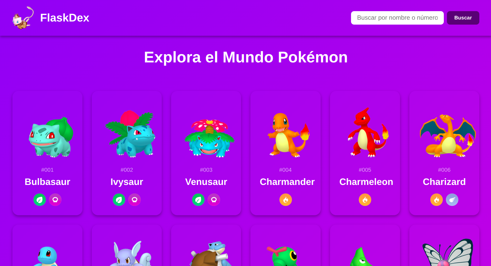
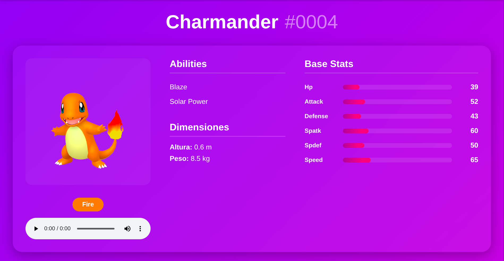

# FlaskDex


Una moderna Pokédex web construida con Flask y PokéAPI. Busca todos los Pokémon con información detallada, estadísticas, habilidades y más.


  [](https://www.python.org/)
  [](https://flask.palletsprojects.com/)


## Características

- **Interfaz Moderna**: Diseño responsivo con animaciones fluidas
- **Búsqueda Inteligente**: Busca Pokémon por nombre o número
- **Estadísticas Completas**: Visualiza stats con barras de progreso
- **Gritos de Pokémon**: Escucha el cry de cada Pokémon
- **Tipos y Habilidades**: Información detallada de cada criatura
- **Responsive Design**: Funciona perfectamente en todos los dispositivos
- **Carga Dinámica**: Sistema "Load More" para cargar Pokémon bajo demanda

## Tecnologías

- **Backend**: Python 3.x, Flask
- **Frontend**: HTML5, CSS3, JavaScript
- **API**: [PokéAPI](https://pokeapi.co/)
- **Estilos**: CSS custom con gradientes

## Instalación

### Prerrequisitos

- Python 3.7 o superior
- pip (gestor de paquetes de Python)

### Pasos

1. **Clona el repositorio**
```bash
git clone https://github.com/tu-usuario/flaskdex.git
cd flaskdex
```

2. **Crea un entorno virtual**
```bash
python -m venv venv
```

3. **Activa el entorno virtual**

- Windows:
```bash
venv\Scripts\activate
```

- Linux/Mac:
```bash
source venv/bin/activate
```

4. **Instala las dependencias**
```bash
pip install -r requirements.txt
```

5. **Ejecuta la aplicación**
```bash
python app.py
```

6. **Abre tu navegador**
```
http://127.0.0.1:5000
```

## Uso

### Página Principal
- Navega por la lista de Pokémon
- Haz clic en "Cargar Más Pokémon" para ver más
- Usa la barra de búsqueda para encontrar un Pokémon específico

### Página de Detalle
- Haz clic en cualquier Pokémon para ver su información completa
- Visualiza estadísticas, tipos, habilidades y movimientos
- Escucha el grito característico del Pokémon

## Agradecimientos

- [PokéAPI](https://pokeapi.co/) - Por proporcionar la API gratuita
- Comunidad de Flask y Python

## Screenshots

### Página Principal


### Detalle de Pokémon
